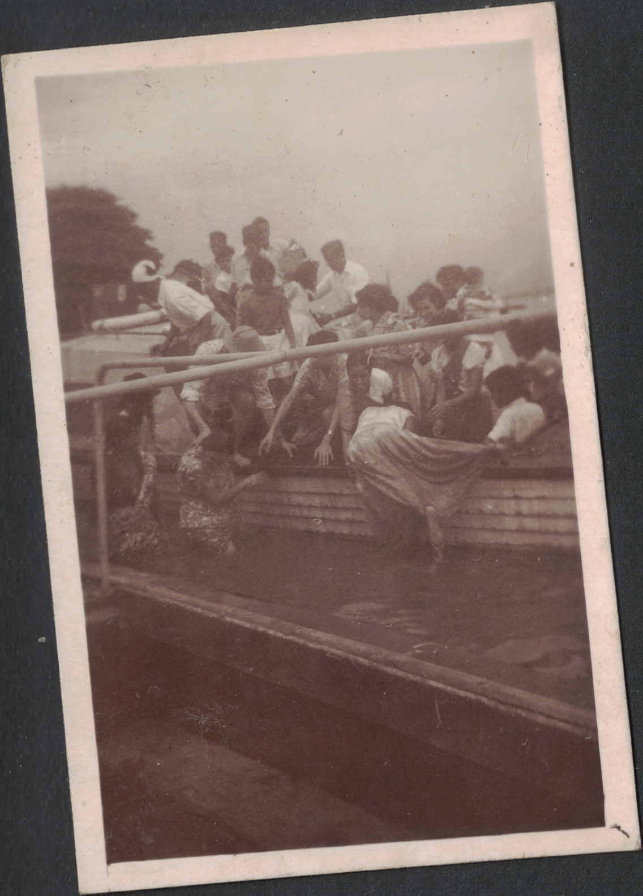
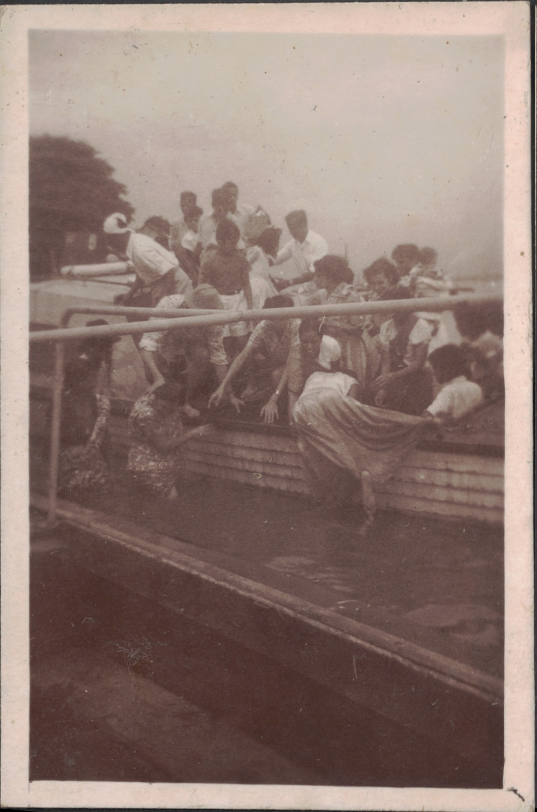
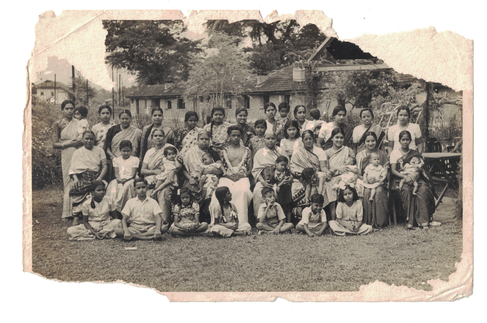
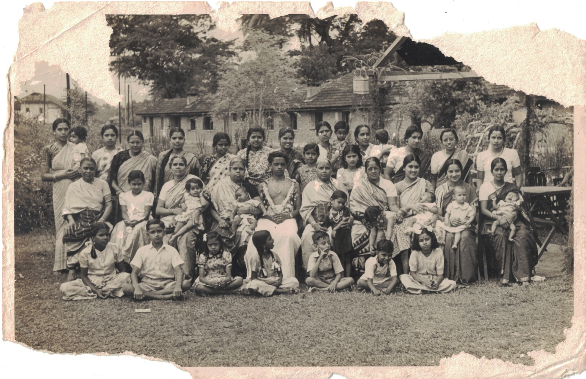

# Trim Pictures

This Python script automatically trims and deskews scanned photos.

When scanning images on a flatbed scanner I've tended to run into a few problems: it's hard to place a photo on the scanner bed such that it ends up being perfectly axis-aligned without chopping off part of the image; and it's hard to accurately trim the boundaries of the scan region to precisely match the edges of the photograph being scanned.

This is an almost-noninteractive command-line tool that helps solve those problems while being robust to background smudges from dirt and dust on the scanner bed. The script works just fine whether the background to be deleted is dark or light. As a bonus, it can also convert images between common file formats.

## Samples
Input                                                              |  Output
:-----------------------------------------------------------------:|:-------------------------:
  |  
  |  

By the way - if you know where the first photo was taken or what's going on in it, or any of the people in the second photo, please contact me!

Of course this works just fine with more modern, colour photo prints as well.

## Installation
As with most other Python software, first clone the repository, then create and activate a virtualenv:

```
$ python -m venv venv
$ source venv/bin/activate
```

Then just install the dependencies listed in requirements.txt:

```
$ pip install -r requirements.txt
```

## Usage
With the virtualenv active,
```
$ python trim.py input.jpg output.jpg
```
It'll bring up a series of windows displaying the image and the contours extracted from it as it goes along; press any key to step through the sequence to the next image. A fully non-interactive mode might be added when I get around to it.

To process a whole folder of images at once just use your shell's loop statment - e.g. in [fish](http://fishshell.com/) (which I highly recommend) I can process a batch of `png` images from an `Originals` folder and write the output files to `jpg` like so:
```
> for i in Originals/*.png
      python trim.py $i (basename $i .png).jpg
  end
```
An analogous construct exists for `bash` as well, of course.